# 基于机器学习预测火山喷发时间
|姓名|学号|院系|
|---|---|---|
|党任飞|211220028|计算机科学与技术|

## 一、背景
火山喷发是指火山口或火山裂缝排出熔岩、火山喷发碎屑（火山灰、火山砾、火山弹和火山块）以及各种气体的过程[5]。火山喷发经常会给现代人类社会造成巨大的生命和财产损失。且由于其突然性、剧烈性，一般而言在火山喷发之后，大量的有毒有害气体、火山灰和碎屑倾泻而下，在没有事先预警的情况下是极其难以躲避的。因此，对火山喷发的预警成为了一个很重要的话题。

一般而言火山喷发前会出现一系列异常现象，可以作为喷发的前兆。这包括地面变形、气体排放和地震活动。而这些前兆是由岩浆从莫霍面上升到地下浅层（2-5公里）以及喷发前火山管道中的岩浆运动引起的[6]。因此，火山喷发前的地壳波动似乎可以用来预测距离火山下一次喷发的时间间隔。如果能比较精准地提前预知火山即将喷发，并且给出比较精确的喷发时间（恰如当前的地震波到达预警），这会给灾情防控、人员疏散、财产转移带来极大的帮助。

但是，如果仅仅依靠安置在火山附近的传感器的数据，很难从传来的波形中判断是否即将发生火山喷发，或者是由其他原因造成的正常的波动。我们很难直接从数据上建立对应的联系。因此，结合计算机科学与技术专业，我考虑使用机器学习方法，乃至神经网络这一“黑盒”算法来尝试寻找传感器数据与火山喷发时间之间的关系。

## 二、数据集
在产生了运用机器学习知识预测火山喷发的想法之后，我开始寻找合适的数据集。

### 2.1 数据集选择
最开始，我找到了`Independent Volcanic Eruption Source Parameter Archive (IVESPA)`数据集[1]，这个数据集是已发布的火山喷发信息的在线档案，用于为喷发柱模型的开发和验证以及喷发羽流高度和大规模喷发率（MER）的经验关系提供信息。但是在我仔细研究数据集和其相关论文[2][3]之后，发现其首先不是和火山喷发时间强相关的数据集，其次它更适于直接研究喷发柱高度、火山灰质量、喷发时风力等因素的相互关系，而不适合使用机器学习算法或者神经网络这一“黑盒”算法来进行预测。

随后，我也在USGS网站上找到了2018夏威夷火山喷发数据集[4]等，但是都不尽如人意。

最后，我在Kaggle上找到了`INGV (Istituto Nazionale di Geofisica e Vulcanologia)`提供的火山喷发预测数据集[10]。

### 2.2 INGV数据集简介
INGV数据集提供了超过30GB的数据。

每一条数据包含十个传感器的一分钟信号数据，每秒钟采样100次，因此每一份数据包含`60s*10*100=60000`个数据。根据奈奎斯特定理，采样率为信号频率的两倍，100Hz的采样频率可以说明采集到了小于50Hz的波形，这基本足以覆盖大多数地震波的频率。并且每一份数据标注了自采样之后到火山喷发的时间间隔，作为机器学习模型的预测目标。

一般认为，火山活动与地震之间有着紧密联系。研究表明，当岩浆向地表运移时，火山机构的应力分布会随之发生改变，同时发生的岩浆破裂和黏滑运动，会导致火山发生规律性的震动，形成火山地震[7]。这种联系不是必然的，但是至少也是强相关的。因此，INGV数据集使用传感器的震动数据对火山喷发进行预测是有着直接的科学依据的，从而可以说明本实验任务和预测目标是可能实现的。

从Kaggle竞赛平台下载的数据包含训练集和测试集，各有15GB左右，其中训练集有很清晰的喷发时间标注，适合对模型进行训练。

### 2.3 数据预处理
由于硬件的制约，我不可能采用特别大型的深度学习神经网络架构，否则将无法训练。

因此，使用卷积神经网络直接在原始数据上进行训练是不可能的。且30GB的数据集对我来说也过于庞大。考虑到训练集的标注清晰，因此我采用Kaggle竞赛提供的训练集同时进行训练和测试。此时训练集有14.8GB。

同时，我发现某些数据的个别传感器采样会产生缺失值，需要进行缺失值处理。但是由于数据集依然过于巨大，如果直接进行缺失值处理然后将每一份数据的60000个波形采样数字全部用来训练，对硬件和时间要求都很高。因此我考虑进行数据形式变换，将每个传感器的6000个采样点的数据转换为能代表波形特征的几个数据，如：
1. 最小值 min。
2. 最大值 max：如果最大值很大，或许可以直接说明火山活动强烈；但是要考虑异常值的影响，所以需要综合其他数据。
3. 平均值 mean：平均振幅，这可能可以代表一段时间内火山活动的强度。更具一般性。
4. 标准差 std：描述火山活动（振幅）的变化程度，体现出火山的不稳定性。
5. 中位数 median。
6. 峰度 Kurtosis：数据分布的尾部与正态分布相比较的陡峭或平坦程度。
7. 偏度 Skewness：数据分布的不对称程度。
8. 峰值频率 Peak frequency：最大峰值所在的频率。

>对于后三个特征，即将喷发的火山的波形肯定与正常的波形有着峰度、偏度、峰值频率上的差距。我希望机器学习模型可以学习到这样的差异并依此做出合理的预测。

这样就可以计算每个传感器的以上八个特征，将6000个数据压缩为8个，极大地压缩数据大小。在计算特征的时候如果发现有缺失值，就考虑使用该传感器的中位数填充。而如果是传感器的数据缺失，也即整列都是缺失值，暂时直接用缺失值代替其各个特征，以保证这一步处理之后的数据格式一致。

经过处理，所有数据被转变为4431*81的矩阵，其中每一行代表一份数据，而前80列每一列代表某个传感器的某个具体特征，最后一列是喷发时间。此时总的数据量为4.22MB。
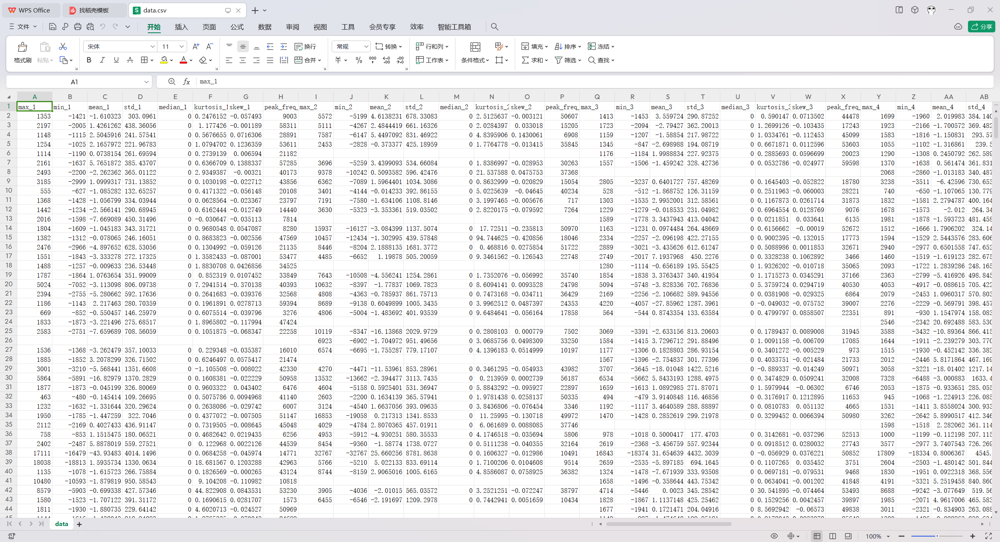

观察发现每个传感器的中位数（如传感器1的`median_1`）都是0，从中可以知道这些数据已经经过了一些处理使之居中。因此我可以直接删除这些中位数数据，因为它对后续的预测不会造成影响。另外，现在仍然可以观察到缺失值，这是因为部分数据缺失了部分传感器的数据，因此接下来采用补充中位数的方法进行缺失值处理。最终得到了完整的数据:

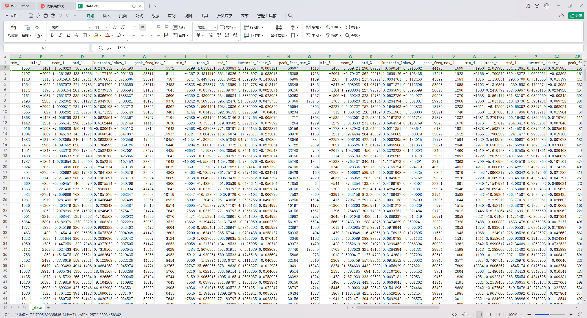

整个表格的前70列是预测使用的数据，最后一列是预测目标。

## 三、模型建构
### 3.1 传统机器学习策略
首先使用最传统的机器学习策略。

对得到的4431条数据进行划分，训练集：测试集 = 8：2。使用以下代码选择基本的模型：
```py
def get_model(name):
    if name == 'linear':
        model = LinearRegression()
    elif name == 'SVM':
        model = sklearn.svm.SVR()
    elif name == 'DecisionTree':
        model = sklearn.tree.DecisionTreeRegressor()
    elif name == 'RandomForest':
        model = sklearn.ensemble.RandomForestRegressor(n_estimators=15)
    return model
```

然后执行以下逻辑进行训练和结果可视化：
```py
    models = ['linear', 'SVM', 'DecisionTree', 'RandomForest']

    model = get_model(models[0])
    model.fit(X_train, y_train)
    pred = model.predict(X_test)
    mse = mean_squared_error(y_test, pred)
    print("MSE:", mse)

    # sort by pred
    sorted_indices = pred_filtered.argsort()
    X_test_sorted = X_test_filtered.iloc[sorted_indices]
    y_test_sorted = y_test_filtered.iloc[sorted_indices]
    pred_sorted = pred_filtered[sorted_indices]

    # visualization
    plt.scatter(range(len(y_test_sorted)), y_test_sorted, color='b', label='True')
    plt.plot(range(len(pred_sorted)), pred_sorted, color='r', label='Regression')
    plt.xlabel('Data Points')
    plt.ylabel('Target')
    plt.title('Comparison of Predictions and True Values')
    plt.legend()
    plt.show()
```

以下是四种模型的结果（其中蓝点是真实值，而红线是我的预测值，按照预测值升序排列）：
LinearRegression:
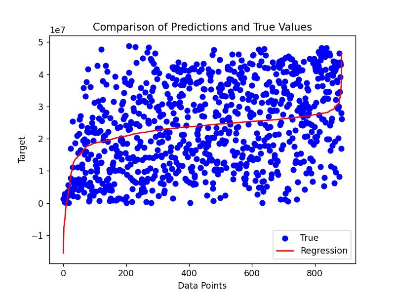

SVM:
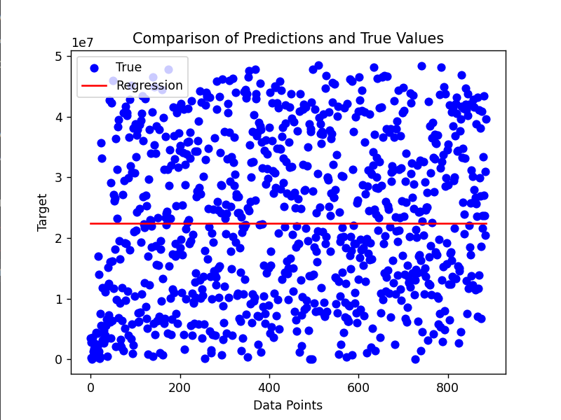

DecisionTree:


RandomForest:
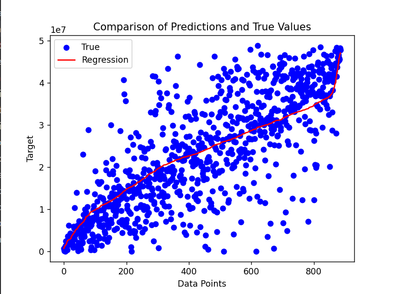

可以看到，`RandomForest`模型的拟合效果已经不错。

针对回归预测任务，我设计了准确率计算方法：如果预测值与真实值的差异不超过真实值的30%（或某个确定的阈值），那么视为预测准确（将其称为30%-准确率）。可以依此计算所有测试样本上的准确率：
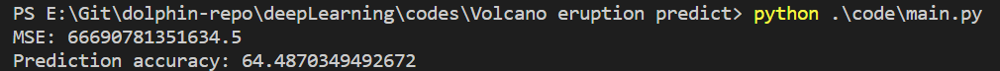

如图所示，30%-准确率达到了64%。其中的`mse`为测试集上的均方误差，由于数据的绝对值较大，一般是1e7、1e8量级，其平方为1e14量级，因此均方误差较高，但是以1e14量级视角来看，`RandomForest`随机森林模型的均方误差也是十四位数，并不算很高。

### 3.2 局限性、对随机森林模型的调整尝试
在`3.1`节中测试发现随机森林的结果最好。但是这只是30%-准确率。

由于预测目标是火山喷发的时间间隔，以秒为单位，因此2e7量级的结果约为一个月，而3e8量级的结果约为一年。也就是说我们的训练集数据基本上是在几个月到一年之内会喷发。按照前面的结果的30%-准确率来说，如果模型预测一年内即将喷发，那么最终有64%的概率在8到16个月之间喷发，预测的范围还不精确。因此需要调整模型的超参数。

在尝试了许多超参数组合之后，我没有观察到准确率的显著提升。因此考虑使用更复杂的模型来进行预测。

### 3.3 神经网络
这里采用最简单的神经网络模型：多层感知机模型（MLP）。

使用如下代码定义MLP模型（其中有许多超参数可以后续调整）：
```py
from sklearn.neural_network import MLPRegressor

def get_model(name):
    if name == ···:
    ······
    elif name == 'MLP':
        model = MLPRegressor(   
                hidden_layer_sizes=(100, 100), 
                activation='relu', 
                solver='adam',
                alpha=0.0001, 
                batch_size='auto', 
                learning_rate='constant', 
                learning_rate_init=0.01, 
                max_iter=500, 
                random_state=42
        )
    return model
```

初步测试下来准确率只有三分之一左右，考虑到数据的量级很大，在深度学习中很有可能造成梯度消失或者梯度爆炸，因此需要对数据进行进一步处理，采用`MinMaxScaler`，将所有特征归一化为[0, 1]之间的数字。这样一来，特征与预测目标的量级差距很大，因此不进行模型参数大小的限制，进行训练，发现收敛的时候一般达到了如下结果：
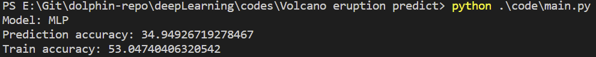

测试集上的准确率依然不高。而如果强行进行模型神经元数量的调整，在训练集上可以得到极大提升，但是测试集效果反而变差了——发生了过拟合：
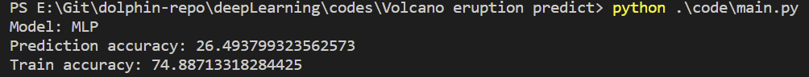

自此，可以说神经网络应用在目前的数据集上是不可行的。

### 3.4 反思与调整
经过之前的测试，我发现在模型上进行调整已经不可能进一步提升准确率了。观察最佳表现的模型随机森林的结果图：


可以看到有一些数据点距离我的预测偏差很大（即图中左上角和右下角的数据蓝点），而大多数数据以一个较为松散的状态分布在预测线（红线）上下。这可能意味着原始数据出现了问题。

也就是说，我使用的七个数据（去掉了中位数）：
1. 最小值 min
2. 最大值 max
3. 平均值 mean
4. 标准差 std
5. 峰度 Kurtosis
6. 偏度 Skewness
7. 峰值频率 Peak frequency

并不能很好地描述压缩之前的每个传感器的6000个采样点数据，无法充分捕捉到数据的复杂性和细节，导致预测的偏差较大。我需要寻找更好的数据压缩表示方法。依然是考虑到数据是一个火山地震的波形，我可以额外提取火山地震的时域和频域特征，这基于一个比较“显然”的假设：火山地震与一般的地面震动的时域变化和频域信息是不同的。

为了这一基本假设，我新增了两个函数`extract_time_domain_features()`和`extract_frequency_domain_features()`用于从给定的数据中提取时域特征和频域特征。
+ extract_time_domain_features:
  + root_mean_square（均方根）特征计算了数据的平方值的均值的平方根，它是数据的有效值的度量。它表示了信号的整体振幅。
  + zero_crossing_rate（过零率）特征计算了信号穿过零的次数除以信号的长度。它可以用来衡量信号的变化率和频率。
+ extract_frequency_domain_features:使用快速傅里叶变换（FFT）将时域数据转换为频域数据。
  + spectrum_energy（频谱能量）特征计算了频域数据的能量，即频谱中各频率成分的幅值的平方和。它表示了信号在不同频率上的能量分布。
  + dominant_frequency（主频成分）特征计算了频谱中具有最大幅值的频率成分的索引。它表示了信号中占主导地位的频率成分。
  通过提取这些特征，可以从时域和频域的角度对信号进行分析，以获取关于信号的不同方面的信息，例如振幅、频率和能量等。这些特征可以在许多信号处理和机器学习任务中使用，例如模式识别、信号分类和异常检测等。

这样一来每一份数据（csv文件中一行）有`(7+4)*10=110`个特征。在获得了这些数据之后，重新进行随机森林和MLP的测试。

#### Random Tree
使用新的数据，测试得到如下结果：

预测数据分布：可以看到蓝点分布距离红线更近，而且左上角和右下角的异常数据更少。
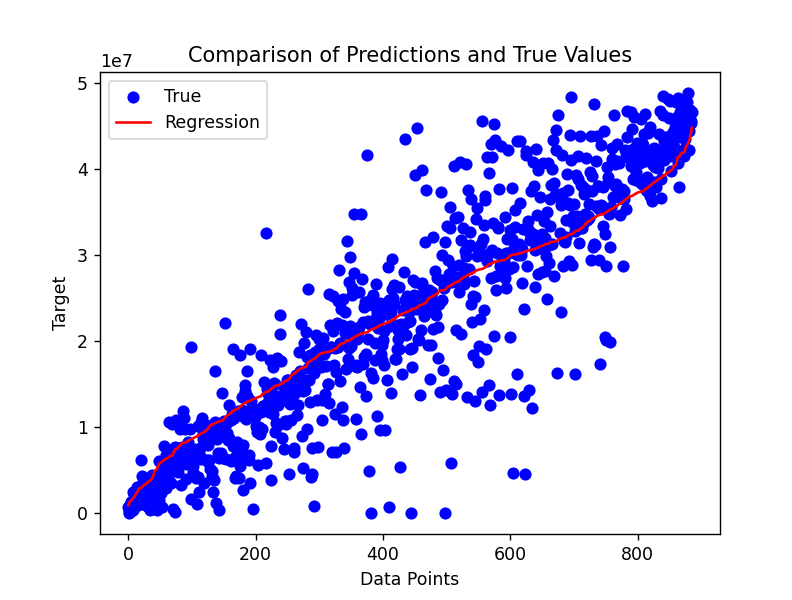

准确率方面：30%-准确率达到了74%；25%-准确率有68%；20%-准确率也有61%。

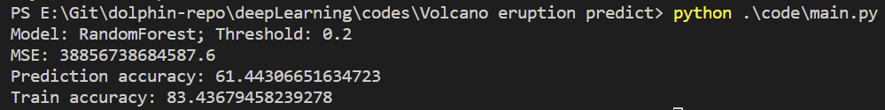
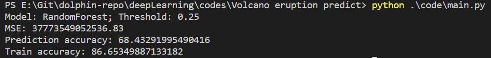
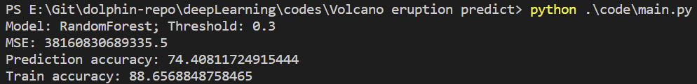

#### MLP
首先按照数据预处理的方法将数据归一化，然后调用MLP模型并调整参数，发现其输出结果如下：
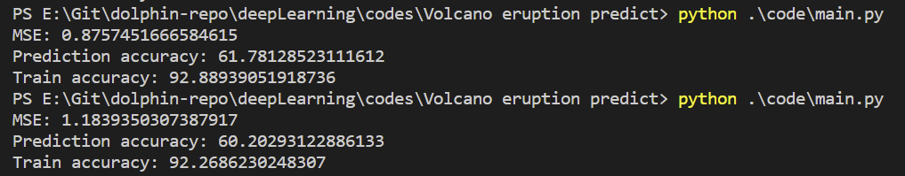

可以看出，训练集的准确率非常高，而测试集的30%-准确率为60%左右，这说明产生了过拟合。但是无论如何调整超参数，最终的结果始终为60%上下，并不如随机森林的74%好。

## 四、总结
根据我在谷歌学术上的查找，一直以来始终有人致力于使用机器学习的方法进行火山喷发预测[6]，更有采用深度学习的做法[3]。仅仅针对`INGV`这个数据集，其比赛的top3方法中就有使用卷积神经网络和长短时记忆网络的做法[8]。除此之外，谷歌学术上搜索"Deep Learning Volcano Prediction"可以找到很多使用计算机视觉方法来分析火山的卫星图像以监测火山活动[9]等火山相关的论文。因此可以说，计算机机器学习技术在火山监测等领域已经得到了相当广泛的研究和应用。

然而受限于硬件、时间等因素，本文仅仅是使用基础的INGV数据集，利用传感器震动数据对火山的活动进行极为简单的预测，并探究其背后关系。在整个探究过程中，最大的突破有如下两点：
+ 火山周边的大地震动数据十分庞大，但是如果采用有效手段对其进行压缩，依然可以得到振动波型中的很大一部分信息量（15GB压缩至4MB）。
+ 如果使用更加专业性的特征提取方式，如快速傅里叶变换FFT等，则可以进一步减少信息的损失，大大提高小模型预测的准确性（30%-准确率达到74%，而训练时间在十秒以内）。

显而易见，如果没有其他限制可以使用更大型的机器学习模型，预测的准确率还会进一步提升。

可以畅想，如果未来收集更多数据如：
+ 不同深度、不同位置的传感器震动波形
+ 火山附近温度变化
+ 火山附近气体含量变化
+ 地表形变
+ 卫星图像

我们可以构造更加全面的预测模型，从而更加精准地预测火山喷发时间，甚至喷发的强度、持续时间，并更好地为防灾、救灾，人员安置、财产转移规划做出贡献。

## 参考资料
[1] https://www.ivespa.co.uk/

[2] Aubry T J, Engwell S, Bonadonna C, et al. The Independent Volcanic Eruption Source Parameter Archive (IVESPA, version 1.0): A new observational database to support explosive eruptive column model validation and development[J]. Journal of Volcanology and Geothermal Research, 2021, 417: 107295.

[3] Venegas P, Pèrez N, Benítez D S, et al. Building machine learning models for long-period and volcano-tectonic event classification[C]//2019 IEEE CHILEAN Conference on Electrical, Electronics Engineering, Information and Communication Technologies (CHILECON). IEEE, 2019: 1-6.

[4] https://www.usgs.gov/data/database-ground-motions-tectonic-and-volcanic-events-hawaii-2018

[5] https://en.wikipedia.org/wiki/Types_of_volcanic_eruptions

[6] Parra J, Fuentes O, Anthony E Y, et al. Use of Machine Learning to Analyze and--Hopefully--Predict Volcano Activity[J]. 2016.

[7] 段政,张翔,陈荣等.火山监测研究进展及其对中国火山灾害监测预警工作的启示[J].华东地质,2022,43(04):391-414.DOI:10.16788/j.hddz.32-1865/P.2022.04.002

[8] https://www.kaggle.com/c/predict-volcanic-eruptions-ingv-oe/discussion/211315

[9] Anantrasirichai N, Biggs J, Albino F, et al. A deep learning approach to detecting volcano deformation from satellite imagery using synthetic datasets[J]. Remote Sensing of Environment, 2019, 230: 111179.

[10] https://www.kaggle.com/c/predict-volcanic-eruptions-ingv-oe/overview